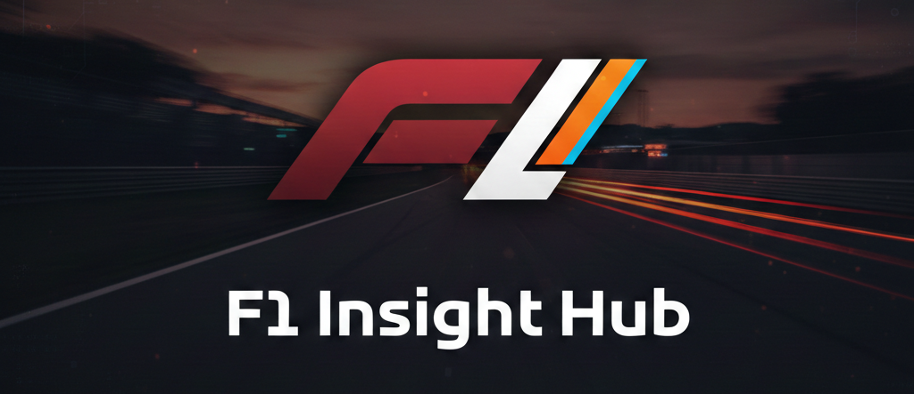

# F1 Insight Hub

<div align="center">
  
</div>

> **Lightning-fast Formula 1 telemetry analysis and race visualization**

A Python-based Formula 1 data visualization and analytics platform that brings real-time telemetry, race replays, and predictive insights to life.

---

## 🎯 Key Features

**⚡ Blazingly Fast**
- Real-time race visualization with Arcade 3D engine
- Optimized telemetry processing with Pandas & NumPy
- Live data streaming from FastF1 API

**📊 Powerful Analytics**
- Performance comparisons between drivers
- Tire strategy visualization
- Weather impact analysis
- Lap-by-lap detailed metrics

**🚀 Modular Design**
- Vision module for 3D race replay
- Analytics module for statistical deep dives
- Intelligence module (coming soon) for predictive insights

---

## 📦 Modules

### 🏁 Module Vision
3D race visualization with real-time telemetry replay, powered by **Arcade Engine**.

**[Add screenshot here]**

### 📈 Module Analytics
Performance analytics including lap times, pace comparisons, tire strategies, and driver statistics.

**[Add screenshot here]**

### 🤖 Module Intelligence
*Coming Soon* - ML-powered race strategy simulations and predictive modeling.

---

## 🏗️ System Architecture

```
┌─────────────────────────────────────────────────────────────┐
│                     Main Dashboard                           │
│                      (PySide6 GUI)                           │
│                                                              │
│  • Year/Round Selection   • Session Type Toggle              │
│  • Event Calendar         • Launch Controls                  │
└─────────────────────────────────────────────────────────────┘
                              │
                ┌─────────────┼─────────────┐
                │             │             │
         ┌──────▼──────┐  ┌──▼──────┐  ┌──▼─────────┐
         │   Vision    │  │Analytics│  │Intelligence│
         │   Module    │  │ Module  │  │  Module    │
         │             │  │         │  │            │
         │  Arcade 3D  │  │Pandas   │  │Scikit-learn│
         │  Engine     │  │Matplotlib
         └──────┬──────┘  └──┬──────┘  └──┬─────────┘
                │             │             │
                └─────────────┼─────────────┘
                              │
                 ┌────────────▼────────────┐
                 │   Data Engine           │
                 │  (data_engine.py)       │
                 │                         │
                 │ • Session Loading       │
                 │ • Telemetry Processing  │
                 │ • Weather Analysis      │
                 └────────────┬────────────┘
                              │
                 ┌────────────▼────────────┐
                 │   FastF1 API            │
                 │  (F1 Live Data)         │
                 │                         │
                 │ • Timing Data           │
                 │ • Car Telemetry         │
                 │ • Weather Updates       │
                 └─────────────────────────┘
```

---

## 🛠️ Tech Stack

| Component | Technology |
|-----------|-----------|
| **Frontend** | PySide6 (Qt Framework) |
| **Visualization** | Arcade 3D Engine |
| **Data Processing** | Pandas, NumPy, SciPy |
| **Analysis** | Scikit-learn, Matplotlib |
| **Data Source** | FastF1 3.7.0 API |
| **Python** | 3.11+ |

---

## ⚙️ Installation

```bash
# Clone the repository
git clone https://github.com/SarangPratap/F1-Insight-Hub.git
cd F1-MainV2

# Create conda environment
conda create -n f1 python=3.11

# Activate environment
conda activate f1

# Install dependencies
pip install -r requirements.txt
```

---

## 🚀 Quick Start

```bash
python main.py
```

Then:
1. Select a season and Grand Prix
2. Choose Race or Sprint session
3. Click to launch visualization or analytics

---

## 📁 Project Structure

```
F1-MainV2/
├── main.py                 # Dashboard launcher
├── data_engine.py          # Data fetching & processing
├── module_vision.py        # Arcade 3D visualization
├── module_analytics.py     # Performance analytics
├── module_intelligence.py  # (Coming Soon)
├── config.py               # Settings & constants
├── requirements.txt        # Dependencies
└── data/                   # Cached race data
```

---

## 🔄 Data Flow

```
User Selection → Validation → Data Fetch → Processing → Visualization/Analysis
```

- **FastF1 API** pulls live timing data from official F1 servers
- **Data Engine** caches results locally for faster access
- **Each Module** processes data according to its needs
- **Results** displayed in real-time or as static analysis

---


---

## 🎯 Features at a Glance

✨ Real-time telemetry visualization  
✨ Race replay with adjustable playback speed  
✨ Driver performance comparisons  
✨ Weather impact analysis  
✨ Tire strategy visualization  
✨ Lap-by-lap detailed metrics  

---

## 🔮 Roadmap

- [ ] Module Intelligence with ML predictions
- [ ] Historical season comparisons
- [ ] Custom race scenarios
- [ ] Real-time race notifications
- [ ] Export analytics to PDF/Excel

---

## 📚 Documentation

- [User Guide](./docs/user-guide.md)
- [API Reference](./docs/api-reference.md)
- [Contributing](./CONTRIBUTING.md)

---

## 💬 Community

- [Discussions](https://github.com/SarangPratap/F1-Insight-Hub/discussions)
- [Issues](https://github.com/SarangPratap/F1-Insight-Hub/issues)

---

## � Contributors

This project is built and maintained by:
- **Sarang Pratap** - Core development, visualization architecture , data processing
- **Avishkar Sanjay Potale** - Core development, Analytics module, visualization architecture

---

## 🙏 Acknowledgments

Special thanks to:
- [**F1 Race Replay**](https://github.com/IAmTomShaw/f1-race-replay) by Tom Shaw - Inspiration for telemetry visualization and race replay mechanics
- [**FastF1**](https://github.com/theOehrly/Fast-F1) - Official F1 telemetry data API
- The F1 and open-source communities for their contributions and support

---

## �📄 License

MIT License - see LICENSE file for details

---

**Built with passion for Formula 1 and data visualization.** 🏁
