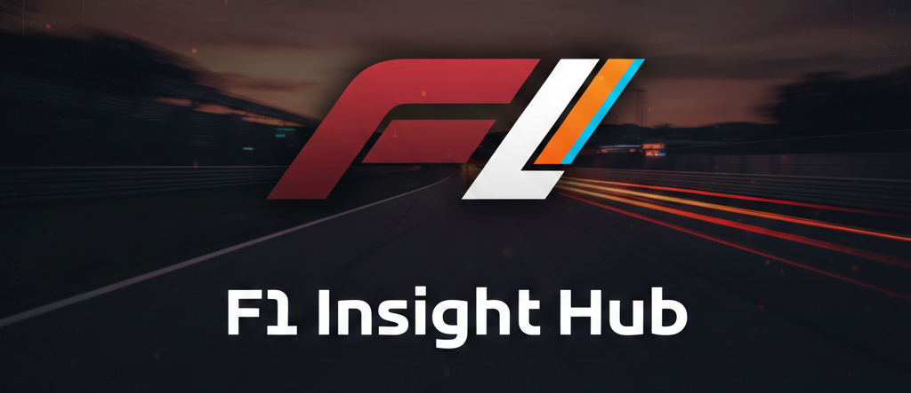

# F1 Insight Hub

<div align="center">
  
</div>

> **Lightning-fast Formula 1 telemetry analysis and race visualization**

A Python-based Formula 1 data visualization and analytics platform that brings race replays, telemetry analysis, and performance insights to life — powered by the FastF1 API.

---

## 🎯 Key Features

**⚡ Blazingly Fast**
- Real-time 2D race visualization with Arcade engine
- Optimized telemetry processing with Pandas & NumPy
- On-demand data fetching from the FastF1 API with local caching

**📊 Powerful Analytics**
- Performance comparisons between drivers
- Tyre strategy visualization
- Weather impact analysis (day/night detection, rain, fog)
- Lap-by-lap detailed metrics & sector times

**🚀 Modular Design**
- Vision module for 2D animated race replay
- Analytics module for statistical deep dives
- Intelligence module (future work) for predictive insights

---

## 📦 Modules

### 🏁 RaceVision
2D animated race replay with real-time telemetry, powered by the **Arcade** engine. Features include a live leaderboard, animated weather widget, DRS zone overlay, driver info panel with throttle/brake animations, and variable-speed playback (0.1× to 256×).


### 📈 RaceAnalytics
Post-race performance analytics built with **PySide6** and **Matplotlib**. Includes race summary cards (winner, fastest lap, top speed, sectors), fastest lap delta bar chart, and interactive lap progression plots with tyre stint markers.


### 🤖 RaceIntelligence
ML-powered race strategy simulations and predictive modeling using Scikit-learn.


---

## 🏗️ System Architecture

```
┌─────────────────────────────────────────────────────────────┐
│                     Main Dashboard                           │
│                      (PySide6 GUI)                           │
│                                                              │
│  • Year/Round Selection   • Session Type Toggle              │
│  • Event Calendar         • Launch Controls                  │
└─────────────────────────────────────────────────────────────┘
                              │
                ┌─────────────┼─────────────┐
                │             │             │
         ┌──────▼──────┐  ┌──▼──────────┐  ┌──▼─────────┐
         │   Vision    │  │  Analytics  │  │Intelligence│
         │   Module    │  │   Module    │  │  (Future)  │
         │             │  │             │  │            │
         │  Arcade 2D  │  │  PySide6 +  │  │Scikit-learn│
         │  Engine     │  │  Matplotlib │  │            │
         └──────┬──────┘  └──┬──────────┘  └──┬─────────┘
                │             │                │
                └─────────────┼────────────────┘
                              │
                 ┌────────────▼────────────┐
                 │   Data Engine           │
                 │  (data_engine.py)       │
                 │                         │
                 │ • Session Loading       │
                 │ • Telemetry Processing  │
                 │ • Weather Analysis      │
                 │ • Local Caching (.pkl)  │
                 └────────────┬────────────┘
                              │
                 ┌────────────▼────────────┐
                 │   FastF1 API            │
                 │  (F1 Official Timing)   │
                 │                         │
                 │ • Timing Data           │
                 │ • Car Telemetry         │
                 │ • Weather Data          │
                 │ • Track Status Events   │
                 └─────────────────────────┘
```

---

## 🛠️ Tech Stack

| Component | Technology |
|-----------|-----------|
| **Main GUI** | PySide6 (Qt 6) |
| **Race Replay** | Arcade 2D Engine |
| **Data Processing** | Pandas, NumPy |
| **Charting** | Matplotlib |
| **Data Source** | FastF1 API (≥ 3.0) |
| **Python** | 3.11+ |

---

## ⚙️ Installation

```bash
# Clone the repository
git clone https://github.com/SarangPratap/F1-Insight-Hub.git
cd F1-MainV2

# (Recommended) Create a virtual environment
python -m venv venv

# On Windows:
venv\Scripts\activate

# On macOS/Linux:
source venv/bin/activate

# Install dependencies
pip install -r requirements.txt
```

> **Note:** The first time you select a race, FastF1 will download and cache the session data. This can take 1–3 minutes depending on your internet speed. Subsequent loads are instant from local cache.

---

## 🚀 Quick Start

```bash
python main.py
```

Then:
1. Select a **season year** (2018–2025) from the dropdown
2. Click on a **race** in the calendar
3. Choose **Race** or **Sprint** session
4. Click **RaceVision** or **RaceAnalytics** to launch

### RaceVision Controls

| Key | Action |
|-----|--------|
| `Space` | Pause / Resume |
| `←` / `→` | Rewind / Forward |
| `↑` / `↓` | Increase / Decrease speed |
| `R` | Restart |
| `D` | Toggle DRS zones |
| `L` | Toggle driver labels |
| `H` | Toggle help panel |

---

## 📁 Project Structure

```
F1-MainV2/
├── main.py                 # Main dashboard launcher (PySide6)
├── config.py               # Shared settings, colors, constants
├── data_engine.py          # Data fetching, processing & caching
├── module_vision.py        # RaceVision: 2D race replay (Arcade)
├── module_analytics.py     # RaceAnalytics: charts & statistics (PySide6 + Matplotlib)
├── requirements.txt        # Python dependencies
├── assets/
│   └── Banner.png          # Project banner image
└── data/
    └── cache/              # Cached race data (auto-generated)
```

---

## 🔄 Data Flow

```
User Selection → FastF1 API → Data Engine → Module Rendering
```

- **FastF1 API** fetches timing data on-demand from official F1 servers
- **Data Engine** processes telemetry in parallel (multiprocessing) and caches results locally as `.pkl` files
- **RaceVision** uses frame-by-frame telemetry resampled at 25 FPS
- **RaceAnalytics** uses `session.laps` directly for aggregated analysis

---

## 🎯 Features at a Glance

✨ Animated 2D race replay with track map and car positions  
✨ Race replay with adjustable playback speed (0.1× to 256×)  
✨ Driver performance comparisons  
✨ Animated weather system (sun, rain, moon, fog — day/night aware)  
✨ Tyre strategy visualization with stint markers  
✨ Lap-by-lap detailed metrics & sector times  

---

## 🔮 Roadmap

- [ ] RaceIntelligence module with ML predictions
- [ ] Historical season comparisons
- [ ] Export analytics to PDF/Excel
- [ ] Qualifying session replay in RaceVision

---

## 👥 Contributors

This project is built and maintained by:
- **Sarang Pratap** — Core development, visualization architecture, data processing
- **Avishkar Sanjay Potale** — Core development, analytics module, visualization architecture

---

## 🙏 Acknowledgments

Special thanks to:
- [**F1 Race Replay**](https://github.com/IAmTomShaw/f1-race-replay) by Tom Shaw — Inspiration for telemetry visualization and race replay mechanics
- [**FastF1**](https://github.com/theOehrly/Fast-F1) — Official F1 telemetry data API
- [**Arcade**](https://api.arcade.academy/) — Python game engine for the RaceVision module
- The F1 and open-source communities for their contributions and support

---

**Built with passion for Formula 1 and data visualization.** 🏁
